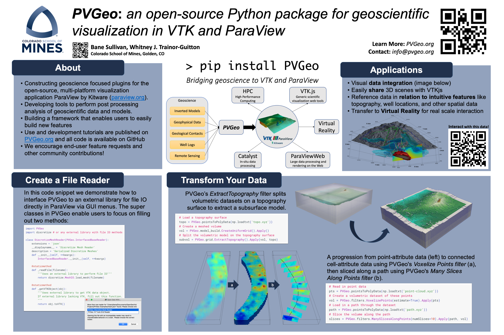
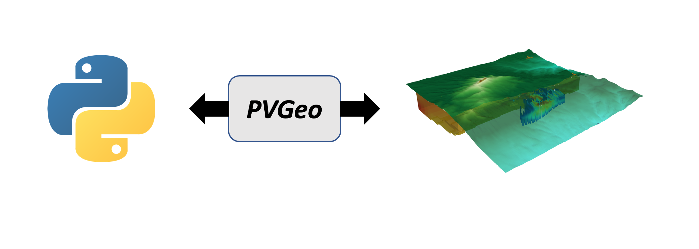
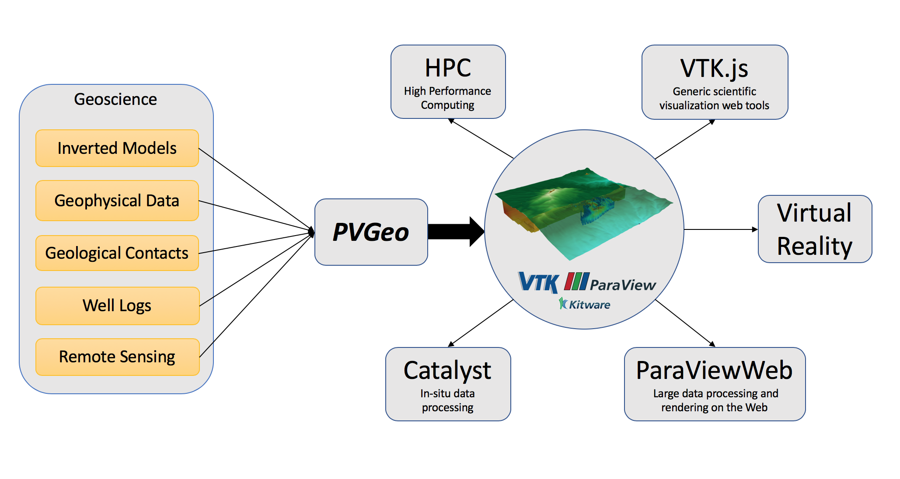
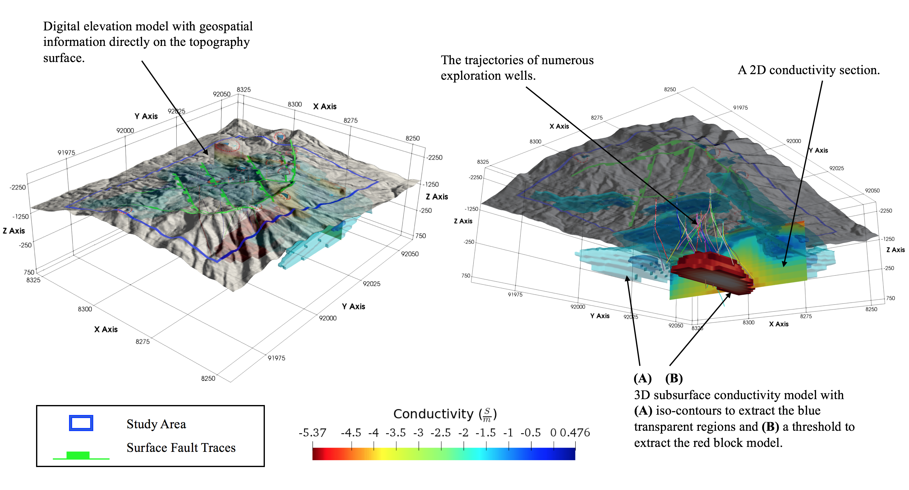

AGU 2018
========

PVGeo was a part of the 2018 AGU session `A Tour of Open-Source Software Packages for the Geosciences <https://agu.confex.com/agu/fm18/meetingapp.cgi/Session/56864>`_

We thought the best way to share our poster and lightning talk would be in the form
of a dynamic webpage where people can stop by, interact with the visualizations,
and download code to do it themselves!

The Poster
----------

First and foremost, here's the poster:

The Lightning Talk
------------------

This section of the page was developed for a 5 minute lightning talk
during the 2018 AGU session.

Moving Towards Visualization
++++++++++++++++++++++++++++

Typically, the 3D/4D aspects of visualization routines are separated from
the processing code and software. This often requires researchers to convert
their working data to other formats, creating static copies of their data files.
Having static conversions of data can lead to messy working directories and
trouble managing outdated data files, especially on larger projects.
To mitigate this, we present PVGeo as tool to work towards dynamically linking
processing to visualization, such that visualization becomes both a part of
the routine for the researcher as well as a tool for post processing analysis
and communication of findings.

What is PVGeo?
++++++++++++++

- **Python** package at its core for 3D/4D geovisualization.
- Create compelling and **integrated visualizations**.
- Built upon **VTK**, a scalable and well-maintained visualization library.
- Extends geovisualization into **ParaView**, **VTK.js**, and **Virtual Reality**.
- **Open-source**: contribute on `GitHub <https://github.com/OpenGeoVis/PVGeo>`_

PVGeo Resources
+++++++++++++++

- `Brief demo page <http://demo.pvgeo.org>`_
- `Slack community <http://slack.pvgeo.org>`_
- `The code <https://github.com/OpenGeoVis/PVGeo>`_
- `Use examples in ParaView <../about-examples>`_
- `Nitty gritty code docs <http://docs.pvgeo.org>`_
- `Vimeo video examples <https://vimeo.com/user82050125>`_

PVGeo in ParaView
+++++++++++++++++

PVGeo is built for direct use within ParaView, leveraging brand new features
in ParaView for Python based plugins that can leverage ParaView's powerful
graphical user interface.

To learn more about what PVGeo looks like within ParaView, check out the
videos on the `About Examples Page <../examples/about-examples>`_ or
other videos throughout the examples which are all posted to our
`Vimeo Account <https://vimeo.com/user82050125>`_.

PVGeo in Python
+++++++++++++++

PVGeo is built to work in Python 3 across operating systems.
Once PVGeo and `vista <http://docs.vista.org>`_ are installed to your
active environment you can get to
work using PVGeo directly in your workflows for analysis, data integration,
and visualization!

.. code-block:: python

    import PVGeo
    import vista

To learn more about using PVGeo in your Python environment, check out the
psuedo-code on the `About Examples Page <../examples/about-examples>`_

Interoperability
++++++++++++++++

You can easily extend PVGeo by diving into the source code and
adding new algorithms or even entire new suites! Or simpler, you could create
a plugin file that gets installed adjacent to your library that leverages
PVGeo.

For example, say your library has some spectacular file IO code or you can
predefine processing routines in parameter files; then create a file reader
algorithm that extends one of PVGeo's many base classes to parse your input
data/parameter file, leverage your library for the work, then sends the results
to ParaView for immediate visualization.

Example
~~~~~~~

Create a new reader algorithm and place it in a ``.py`` file like this one
we built for `discretize <http://discretize.simpeg.xyz/en/latest/>`:

.. code-block:: python

    # Import PVGeo for all its awesome super classes
    from PVGeo import InterfacedBaseReader
    from PVGeo import _helpers
    # Import the library you wish to leverage
    import discretize

    @smproxy.reader(name="DiscretizeMeshReader",
           label='PVGeo: Discretize Mesh Reader',
           extensions='json',
           file_description='Serialized Discretize Meshes')
    class DiscretizeMeshReader(InterfacedBaseReader):
        """A general reader for all ``discretize`` mesh objects saved to the
        ``.json`` serialized format"""
        def __init__(self, **kwargs):
            InterfacedBaseReader.__init__(self, **kwargs)

        #### Methods that will talk to the external library ####

        @staticmethod
        def _read_file(filename):
            """Reads a mesh object from the serialized format"""
            return discretize.MeshIO.load_mesh(filename)

        @staticmethod
        def _get_vtk_object(obj):
            """Returns the mesh's proper VTK data object"""
            return obj.toVTK()

        #### Setters and Getters for the GUI ####

        @smproperty.xml(_helpers.getFileReaderXml('json', readerDescription='Serialized Discretize Meshes'))
        def AddFileName(self, fname):
            """This enables users to select File->Open... in ParaView"""
            InterfacedBaseReader.AddFileName(self, fname)

        @smproperty.doublevector(name="TimeDelta", default_values=1.0, panel_visibility="advanced")
        def set_time_delta(self, dt):
            """Allows the user to speed up/slow down the time interval if reading a time series of data"""
            InterfacedBaseReader.set_time_delta(self, dt)

        @smproperty.doublevector(name="TimestepValues", information_only="1", si_class="vtkSITimeStepsProperty")
        def get_timestep_values(self):
            """This is critical for registering the timesteps (if you want them)"""
            return InterfacedBaseReader.get_timestep_values(self)

Install PVGeo
+++++++++++++

Eager to give PVGeo a try? The easiest way to install PVGeo is from PyPI using
pip:

.. raw:: html

    > pip install PVGeo

You should follow the `getting started guide <./getting-started>`_

Take aways
++++++++++

- Join `PVGeo on Slack <http://slack.pvgeo.org>`_
    - The slack workspace is for anyone using ParaView for geovisualization
- ParaView natively extends into VR (dynamically linked)
- VTK and ParaView are incredibly scalable
- PVGeo is Python based and open-source

Here is an example of what can be done in ParaView via PVGeo with an interactive
and shareable version below:

.. raw:: html

    

            <iframe src="http://playground.pvgeo.org" frameborder="0" allowfullscreen style="position: absolute; top: 0; left: 0; width: 100%; height: 100%;"></iframe>
    

